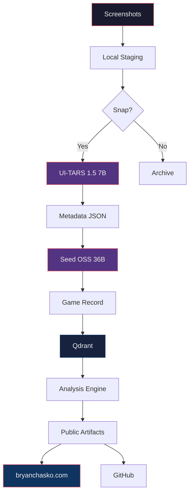

# Marvel Snap Cybernetic Loop


A fully automated, privacy-preserving pipeline that ingests Marvel Snap screenshots, reconstructs games, analyzes play patterns, and publishes curated public artifacts.

Built by [Bryan Chasko](https://bryanchasko.com) and the [HeraldStack](https://github.com/BryanChasko) multi-platform agent architecture.

---

## What This Does

```
Screenshots → Classification → Metadata → Game Records → Analysis → Public Artifacts
```

You play Marvel Snap. You take screenshots. Everything after that is automated.

The pipeline classifies screenshots, extracts game state (cards, locations, turns, cubes), reconstructs full matches, computes competitive analytics, and publishes anonymized results to your website and GitHub.

## Architecture



## Privacy Model

Not a privacy architecture. Just: don't give ByteDance your Google credentials.

| Zone | What Lives Here | Who Touches It |
|------|----------------|----------------|
| **Local** | Google creds, raw screenshots | Goose-cli local agents only |
| **Hybrid** | Sanitized game screenshots | ByteDance models via OpenRouter |
| **Public** | Anonymized game records, analysis | The world |

Data flows one direction: local → hybrid → public. Never reversed.

## ByteDance Models (via OpenRouter)

| Model | Alias | Use Case | Cost |
|-------|-------|----------|------|
| [UI-TARS 1.5 7B](https://openrouter.ai/bytedance/ui-tars-1.5-7b) | `bytedance-vision` | Screenshot classification, game UI recognition | $0.10/$0.20 per M tokens |
| [Seed OSS 36B](https://openrouter.ai/bytedance/seed-oss-36b-instruct) | `bytedance-reason` | Game reconstruction, analysis reasoning | TBD |

Daily cost cap: $0.01. That's ~50-100 classifications per day.

## Pipeline Layers

| Layer | Recipe | What It Does |
|-------|--------|--------------|
| 1. Ingestion | `snap-ingest.yaml` | Watch local folder, queue new screenshots |
| 2. Classification | `snap-classify.yaml` | Is this Marvel Snap? (UI-TARS) |
| 3. Reconstruction | `snap-reconstruct.yaml` | Build turn-by-turn game record (Seed OSS) |
| 4. Analysis | `snap-analyze.yaml` | Cube efficiency, deck stats, misplays |
| 5. Artifacts | `snap-publish.yaml` | Generate public-safe content, open PRs |
| Orchestrator | `snap-pipeline.yaml` | Run all layers in sequence with CSWR |

## Spec-Driven Development

This project uses spec-driven development. Specs are the source of truth. Code serves specs.

```
specs/
  SPEC-INDEX.md                    # Map of all specs
  marvel-snap-pipeline/
    design.md                      # Architecture (Design-First)
    tasks.md                       # Executable tasks (generate-task-issues.py format)
  private-ingestion/
    requirements.md                # EARS notation requirements
  classification-metadata/
    requirements.md
  game-reconstruction/
    requirements.md
  vendor-gateway/
    requirements.md
```

Requirements use [EARS notation](https://kiro.dev/docs/specs/feature-specs/) (WHEN/THE SYSTEM SHALL) for testability.

## CSWR — Conversation-Scoped Work Reference

Every agent action is anchored to a CSWR before it does anything. The CSWR ties conversations to GitHub issues, specs, and sessions.

```
CSWR = { issue_id, spec_id, conversation_id }
```

Implemented via [prompt-ledger.sh](https://github.com/BryanChasko/goosecli-heraldstack-gander/blob/main/scripts/prompt-ledger.sh) in the gander runtime.

## Execution Platform

Runs on the [gander](https://github.com/BryanChasko/goosecli-heraldstack-gander) — the goose-cli collective of the HeraldStack.

Existing infrastructure leveraged:
- **goose-proxy.py** — heuristic model dispatcher
- **Qdrant** — vector store for game records and semantic search
- **Valkey** — Redis-compatible cache for cost tracking
- **Cedar policies** — governance (no-secrets, branch-naming)
- **Docker hardening** — cap_drop, no-new-privileges, resource limits
- **38+ MCP launchers** — filesystem, GitHub, vision-server, Qdrant, AWS

## Project Governance

- [CONSTITUTION.md](CONSTITUTION.md) — 8 immutable architectural principles
- [SECURITY.md](SECURITY.md) — public repo rules
- [specs/SPEC-INDEX.md](specs/SPEC-INDEX.md) — spec map and validation checklists

## The Team

Built by the HeraldStack haunting:

| Agent | Role |
|-------|------|
| Harald (he/him) | Anchor, coordination |
| Stratia (she/her) | Architect, recipe design |
| Ellow | GooseCLI implementation |
| Myrren | OpenRouter model routing |
| Kade-Vox | Security |
| Ralph Wiggum | QA validation |

## Links

- [bryanchasko.com](https://bryanchasko.com) — Website (game dashboard target)
- [builder.aws.com/community/@bryanchasko](https://builder.aws.com/community/@bryanchasko) — Blog
- [goosecli-heraldstack-gander](https://github.com/BryanChasko/goosecli-heraldstack-gander) — Gander runtime
- [OpenRouter ByteDance models](https://openrouter.ai/bytedance) — Model catalog

## License

MIT
